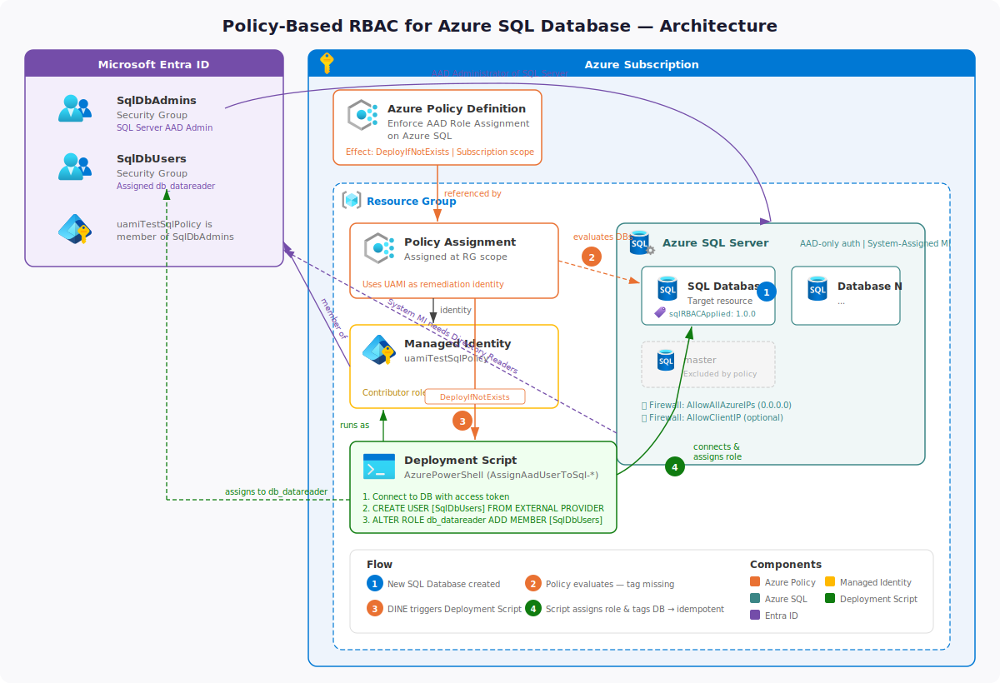
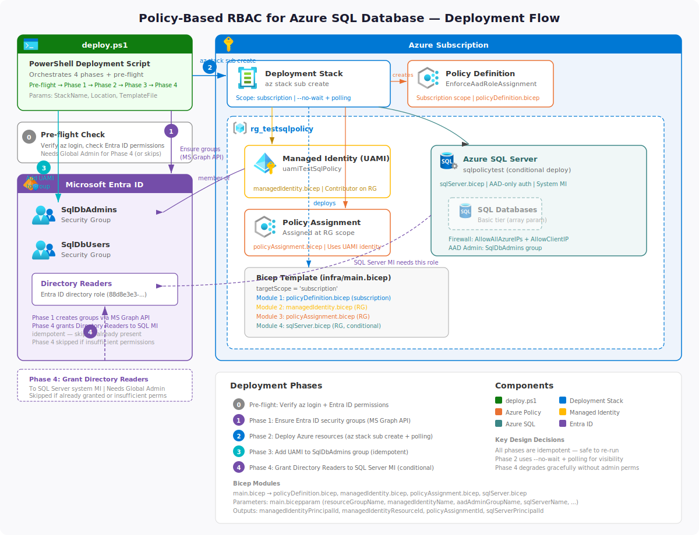
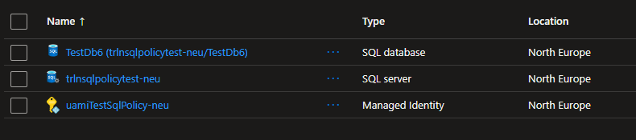

# Enforce AAD Role Assignment on Azure SQL: Solution Overview

## Introduction

This document explains how the "Enforce AAD Role Assignment on Azure SQL" policy works, the required components, and how they interact to automate Azure SQL RBAC assignments using Azure Policy, Managed Identity, and AAD groups.

---

## Solution Summary



The solution ensures that every new Azure SQL database (except `master`) automatically receives an AAD user or group assignment to a specific SQL role. This is achieved by:

- A custom Azure Policy that detects new databases and triggers a deployment script if the RBAC assignment is missing.
- A deployment script that runs as a User Assigned Managed Identity (e.g., `uamiTestSqlPolicy`) to assign the AAD group/user (e.g., `SqlDbUsers`) to the SQL role.
- Tagging the database to prevent repeated assignments.

---

## Components

### 1. Azure Policy Definition
- **Name:** Enforce AAD Role Assignment on Azure SQL
- **Type:** Custom Policy
- **Effect:** DeployIfNotExists
- **Target:** All `Microsoft.Sql/servers/databases` except `master`
- **Parameters:**
  - `principalNameToAssign`: AAD group/user to assign (e.g., `SqlDbUsers`)
  - `userAssignedIdentityResourceId`: Resource ID of the Managed Identity (e.g., `uamiTestSqlPolicy`)

### 2. Deployment Script
- **Runs as:** User Assigned Managed Identity
- **Actions:**
  - Connects to the SQL database using an access token
  - Creates the AAD user/group as a database user if not present
  - Assigns the user/group to the `db_datareader` role
  - Tags the database with `sqlRBACApplied` to mark completion

### 3. User Assigned Managed Identity (uamiTestSqlPolicy)
- **Purpose:** Secure, credential-free authentication for the deployment script
- **Permissions:** Needs Contributor or higher on the resource group

### 4. AAD Groups
- **SqlDbAdmins:** Admin group for SQL admin access
- **SqlDbUsers:** Group assigned as database users (e.g., `db_datareader` role)

---

## How It Works

1. **Policy Assignment:**
   - The policy is assigned at the subscription or resource group level.
2. **Resource Evaluation:**
   - When a new SQL database is created, the policy checks if the `sqlRBACApplied` tag is missing or not set to the current version.
3. **Script Deployment:**
   - If the tag is missing, the policy triggers a deployment script resource.
4. **Script Execution:**
   - The script runs as `uamiTestSqlPolicy`, connects to the database, creates the AAD user/group if needed, assigns the role, and tags the database.
5. **Idempotency:**
   - The tag ensures the script is not re-executed unnecessarily.

---

## Deployment Options

There are two ways to deploy this solution: **declarative (recommended)** using the provided Bicep modules, or **imperative** using the PowerShell script.

---

### Option A: Declarative Deployment with Bicep (Recommended)

The `infra/` directory contains a set of Bicep modules that deploy all required Azure resources declaratively:

```
infra/
├── main.bicep              # Main orchestration template (subscription scope)
├── main.bicepparam         # Parameters file with example values
└── modules/
    ├── managedIdentity.bicep   # User-Assigned Managed Identity + Contributor role
    ├── policyDefinition.bicep  # Azure Policy definition
    ├── policyAssignment.bicep  # Policy assignment (resource group scope)
    └── sqlServer.bicep         # SQL Server with AAD-only auth + databases
```

#### Pre-requisites (one-time, Entra ID operations)

Before running the Bicep deployment, create the two required Entra ID security groups and note the `SqlDbAdmins` object ID:

> **Note:** The Microsoft Graph Bicep extension was evaluated for automating this step but is not usable with interactive `az login` user accounts — the ARM deployment engine receives an ARM-scoped token that cannot be projected to the Graph API. Group creation therefore remains a pre-deployment step. The extension would work with a service principal holding `Group.ReadWrite.All` application permission with admin consent.

```bash
# Create SqlDbAdmins group (SQL Server administrator)
az ad group create \
  --display-name SqlDbAdmins \
  --mail-nickname SqlDbAdmins \
  --description "Group for SQL Database Administrators" \
  --security-enabled true

# Create SqlDbUsers group (assigned db_datareader inside databases)
az ad group create \
  --display-name SqlDbUsers \
  --mail-nickname SqlDbUsers \
  --description "Group for SQL Database Users" \
  --security-enabled true

# Get the object ID of SqlDbAdmins (needed as a Bicep parameter)
az ad group show --group SqlDbAdmins --query id --output tsv
```

#### Deploy with Bicep

1. Edit `infra/main.bicepparam` and replace the `aadAdminGroupObjectId` value with the object ID retrieved above.

2. Run the deployment wrapper — it handles all four phases automatically:

    ```powershell
    ./deploy.ps1
    ```

    

    The script will:
    - **Phase 1:** Ensure the Entra ID security groups exist (creates them if missing, skips if present)
    - **Phase 2:** Deploy all Azure resources via `az stack sub create`
    - **Phase 3:** Add the managed identity to `SqlDbAdmins` (skips if already a member)
    - **Phase 4:** Grant the SQL Server's system-assigned identity the **Directory Readers** Entra ID role (required for AAD group resolution at login time; skipped if the caller lacks Privileged Role Administrator or Global Administrator)

    Optional parameters:
    ```powershell
    ./deploy.ps1 -StackName MyStack -Location westeurope
    ```

3. No further post-deployment steps are required — the wrapper handles the UAMI group membership automatically.

The Bicep deployment handles:
- Creating the User-Assigned Managed Identity (`uamiTestSqlPolicy`)
- Assigning the Contributor role to the identity on the resource group
- Deploying the Azure Policy definition at subscription scope
- Assigning the policy at resource group scope
- Optionally creating the SQL Server (with AAD-only authentication) and initial databases

#### How the remediation script is managed

The PowerShell remediation script (`SetPrincipalName.ps1`) is the **single source of truth** for the SQL RBAC assignment logic. The Bicep policy module loads it directly at compile time using Bicep's built-in `loadTextContent()` function:

```bicep
scriptContent: loadTextContent('../../SetPrincipalName.ps1')
```

This means you only need to edit `SetPrincipalName.ps1` — no manual copy/paste or sync step is required. The updated script content is automatically embedded every time the Bicep template is compiled or deployed.

---

### Option B: Declarative Deployment via CLI (Alternative)

All steps can also be performed manually using Azure CLI commands. See the [Setup Steps](#setup-steps-manual-reference) section below for a step-by-step reference.

---

## Setup Steps (Manual Reference)

1. **Create AAD Groups:** *(one-time pre-requisite before any deployment)*
   - `SqlDbAdmins` (admins on server level)
   - `SqlDbUsers` (users assigned access inside database)

   ```bash
   # Create the SqlDbAdmins security group
   az ad group create \
     --display-name SqlDbAdmins \
     --mail-nickname SqlDbAdmins \
     --description "Group for SQL Database Administrators" \
     --security-enabled true

   # Create the SqlDbUsers security group
   az ad group create \
     --display-name SqlDbUsers \
     --mail-nickname SqlDbUsers \
     --description "Group for SQL Database Users" \
     --security-enabled true
   ```
2. **Create User Assigned Managed Identity:**
   - Name: `uamiTestSqlPolicy`
   - Assign Contributor role on the resource group *(handled by `managedIdentity.bicep`)*
   - **Add the MI to the SqlDbAdmins group** *(post-deployment step — see Option A step 3)*

       ```bash
       uamiObjectId=$(az identity show --name uamiTestSqlPolicy --resource-group <your-resource-group> --query principalId --output tsv)
       az ad group member add --group SqlDbAdmins --member-id $uamiObjectId
       ```

       > This step is mandatory. Without it, the policy-triggered deployment script will fail to authenticate to SQL.

3. **Deploy policy:**
   - Deploy the policy so it can be assigned
    
        ```cli
        # Set variables
        policyName="EnforceAadRoleAssignmentOnAzureSql"

        # Create the custom policy definition
        # The policy is now defined in Bicep (infra/modules/policyDefinition.bicep).
        # If deploying manually without Bicep, export the policy rule JSON first.
        az policy definition create \
        --name $policyName \
        --display-name "Enforce AAD Role Assignment on Azure SQL" \
        --mode Indexed \
        --rules '<policy-rule-json>'
        ```
4. **Assign the Custom Policy:**
   - Use the provided policy JSON
   - Set parameters for the AAD group and Managed Identity

        ```cli
        # Set variables
        policyName="EnforceAadRoleAssignmentOnAzureSql"
        assignmentName="EnforceAadRoleAssignmentOnAzureSql-Assignment"
        subscriptionId="<your-subscription-id>"
        principalNameToAssign="<Name of the AAD group (eg. SqlDbUsers)>"
        userAssignedIdentityResourceId="<managed-identity-resource-id (full Azure resource Id of the managed identity)>"
        resourceGroupName="<resourceGroupName>"

        # Assign the policy to a resourcegroup (change --scope for subscription if needed)
        az policy assignment create \
        --name $assignmentName \
        --policy $policyName \
        --scope /subscriptions/$subscriptionId/resourceGroups/$resourceGroupName \
        --params '{
            "principalNameToAssign": {"value": "'$principalNameToAssign'"},
            "userAssignedIdentityResourceId": {"value": "'$userAssignedIdentityResourceId'"}
        }'
        ```
5. **Deploy New SQL Server:**
   - If not yet available, create a SQL server instance

        ```cli
        az sql server create \
          --name <new-server-name> \
          --resource-group <resourceGroupName> \
          --location <location> \
          --admin-user <admin-user> \
          --admin-password <admin-password> \
          --enable-ad-only-auth true \
          --external-admin-principal-type Group \
          --external-admin-name SqlDbAdmins \
          --external-admin-sid <SqlDbAdmins-object-id>
        ```

   - If you want to assign an Azure AD group as the SQL Server admin after creation, you can use:

        ```cli
        az sql server ad-admin create \
          --resource-group <resourceGroupName> \
          --server <new-server-name> \
          --display-name SqlDbAdmins \
          --object-id <SqlDbAdmins-object-id> \
          --tenant-id <tenant-id>
        ```

   - If public network access is enabled, you may need to configure firewall rules:

        ```cli
        az sql server firewall-rule create \
          --resource-group <resourceGroupName> \
          --server <new-server-name> \
          --name AllowAllAzureIPs \
          --start-ip-address 0.0.0.0 \
          --end-ip-address 0.0.0.0
        ```

6. **Deploy New SQL Databases:**
   - The policy will automatically assign the SqlDbUsers to the database db_datareader role as configured in the powershell script

        ```cli
        az sql db create --resource-group <your-resource-group> --server <your-sql-server> --name TestDb1 --service-objective Basic
        ```

7. **Verify:**
   - Check the database for the user/group and the `sqlRBACApplied` tag

8. **Cleanup:**

   - the policy uses a deploymentScript to execute the remediation, if successfull the deployment script will automatically be deleted after 1 day. Any resources utilized by the deploymentscript are deleted immediately.

        

   - In case of a failure, all will remain for analysis purposes.

---

## Removing the Deployment Stack

The solution is deployed as an Azure deployment stack (`PolicyBasedRbacDeployStack`). Teardown is a two-step process: delete the Azure resources via the stack, then clean up the Entra ID objects that live outside it.

### Step 1 — Delete the deployment stack

Run the following command to delete the stack and all Azure resources it tracks (managed identity, policy definition, policy assignment, SQL Server, and databases):

```powershell
az stack sub delete `
  --name PolicyBasedRbacDeployStack `
  --action-on-unmanage deleteAll `
  --yes
```

> **`--action-on-unmanage deleteAll`** instructs the stack engine to delete every tracked Azure resource when the stack is removed. Replace `PolicyBasedRbacDeployStack` with the name you passed to `-StackName` if you used a custom name.
>
> Use `detachAll` instead of `deleteAll` to stop stack tracking without deleting the underlying resources.

### Step 2 — Remove Entra ID objects (manual)

The Entra ID security groups and the Directory Readers role assignment are **not managed by the stack** and must be removed separately:

1. **Remove the Directory Readers role from the SQL Server's managed identity** *(skip if no SQL Server was deployed)*:

    ```powershell
    $sqlPrincipalId = az sql server show `
      --name <your-sql-server-name> --resource-group <your-resource-group> `
      --query identity.principalId --output tsv

    $drRoleId = az rest --method GET `
      --uri "https://graph.microsoft.com/v1.0/directoryRoles?`$filter=roleTemplateId eq '88d8e3e3-8f55-4a1e-953a-9b9898b8876b'" `
      --query "value[0].id" --output tsv

    az rest --method DELETE `
      --uri "https://graph.microsoft.com/v1.0/directoryRoles/$drRoleId/members/$sqlPrincipalId/`$ref"
    ```

2. **Delete the Entra ID security groups** *(only if they are not used by other resources)*:

    ```bash
    az ad group delete --group SqlDbAdmins
    az ad group delete --group SqlDbUsers
    ```

---

## Troubleshooting

### Login failed for user '\<token-identified principal\>'

**Symptom:** The deployment script log shows `Successfully obtained access token` and `Connecting to: ...` but then fails with:

```
Login failed for user '<token-identified principal>'.
Error Number:18456,State:1,Class:14
```

**Possible causes:**

#### 1. SQL Server missing Directory Readers role

The SQL Server's system-assigned managed identity needs the **Directory Readers** Entra ID directory role to resolve AAD group memberships at login time. Without it, SQL Server cannot verify that the UAMI belongs to the `SqlDbAdmins` group set as the AAD administrator, so it rejects the token.

**Diagnosis:**

```powershell
# Get the SQL Server MI principal ID
$sqlPrincipalId = az sql server show --name <server-name> --resource-group <rg> --query identity.principalId --output tsv

# Find the Directory Readers role ID in the tenant
$drRole = (az rest --method GET --uri "https://graph.microsoft.com/v1.0/directoryRoles" --output json | ConvertFrom-Json).value | Where-Object { $_.roleTemplateId -eq '88d8e3e3-8f55-4a1e-953a-9b9898b8876b' }

# Check membership
az rest --method GET --uri "https://graph.microsoft.com/v1.0/directoryRoles/$($drRole.id)/members/$sqlPrincipalId" --output json
```

If this returns 404 or an error, the SQL Server MI does not have Directory Readers.

**Fix:** Grant Directory Readers to the SQL Server MI:

```powershell
$body = @{ '@odata.id' = "https://graph.microsoft.com/v1.0/directoryObjects/$sqlPrincipalId" } | ConvertTo-Json
$tmpFile = [System.IO.Path]::GetTempFileName()
Set-Content -Path $tmpFile -Value $body -Encoding utf8
az rest --method POST --uri "https://graph.microsoft.com/v1.0/directoryRoles/$($drRole.id)/members/`$ref" --headers "Content-Type=application/json" --body "@$tmpFile"
Remove-Item $tmpFile
```

> **Note:** This role assignment can take several minutes to propagate. Wait at least 5 minutes before re-triggering remediation.

#### 2. UAMI not a member of the SQL Server AAD admin group

The UAMI that runs the deployment script must be a member of the AAD group configured as the SQL Server administrator (e.g. `SqlDbAdmins`).

**Diagnosis:**

```powershell
$uamiPrincipalId = az identity show --name <uami-name> --resource-group <rg> --query principalId --output tsv
az ad group member check --group SqlDbAdmins --member-id $uamiPrincipalId --query value --output tsv
```

If this returns `false`, add the UAMI to the group:

```powershell
az ad group member add --group SqlDbAdmins --member-id $uamiPrincipalId
```

#### 3. Token encoding issue with Az PowerShell 12+

Az PowerShell 12+ returns `Get-AzAccessToken` as a `SecureString`. On Linux containers (where deployment scripts run), using `PtrToStringAuto` to convert the `SecureString` to plain text can produce a garbled token because `PtrToStringAuto` uses encoding based on the OS default (UTF-8 on Linux) while BSTR is always UTF-16.

**Fix:** Use `PtrToStringBSTR` instead of `PtrToStringAuto` in `SetPrincipalName.ps1`:

```powershell
$bstr  = [System.Runtime.InteropServices.Marshal]::SecureStringToBSTR($accessTokenObj.Token)
$token = [System.Runtime.InteropServices.Marshal]::PtrToStringBSTR($bstr)  # NOT PtrToStringAuto
[System.Runtime.InteropServices.Marshal]::ZeroFreeBSTR($bstr)
```

### Re-triggering remediation after a fix

After fixing the root cause, clean up the failed deployment script and create a new remediation:

```powershell
# Delete the failed deployment script
az resource delete --resource-group <rg> --resource-type "Microsoft.Resources/deploymentScripts" --name "AssignAadUserToSql-<dbName>"

# Trigger a new remediation
az policy remediation create --name "remediate-<unique-suffix>" --policy-assignment "EnforceAadRoleAssignmentOnAzureSql-Assignment" --resource-group <rg>
```

### Checking deployment script logs

```powershell
# View the script execution log
az deployment-scripts show-log --name "AssignAadUserToSql-<dbName>" --resource-group <rg> --query "value[0].log" --output tsv

# Check the script status
az resource show --resource-group <rg> --resource-type "Microsoft.Resources/deploymentScripts" --name "AssignAadUserToSql-<dbName>" --query "properties.status" --output json
```

---

## Benefits

- **Automated Compliance:** Ensures all new databases have the correct AAD users/groups assigned
- **Security:** Uses managed identities for secure automation
- **Scalability:** Works across all databases in the assigned scope
- **Auditability:** Tagging provides a clear audit trail

